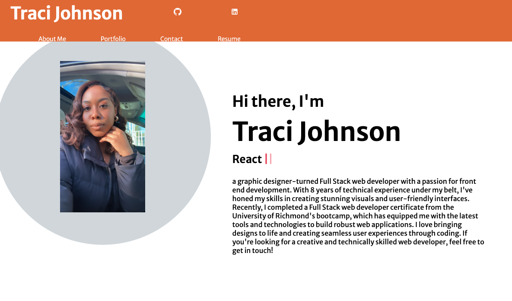

# React Portfolio

## Description
 This is Portfolio using new React skills to be set apart from other developers whose portfolios don’t use the latest technologies. 

## Table of Contents
  * [Description](#description)
  * [Licenses](#licenses)
  * [Installation](#installation)
  * [Usage](#usage)
  * [Contributors](#contributors)
  * [Tests](#tests)
  * [Links](#links)
  * [Questions](#questions)

## Licenses

## Usage

## Contributors
its a pubic repo, contributors are welcome to add to this application.

## Tests
N/A

## Github Link
https://github.com/tracij1286/react-portfolio.git

## Live Site

https://tracij1286.github.io/react-portfolio/

## Sited works
https://www.youtube.com/watch?v=7WwtzsSHdpI 

## Questions
If you have any questions about this repo, contact me directly at tracij50@gmail.com. You can find more of my work at [Tracij1286 on Github](https://github.com/Tracij1286 on Github).

